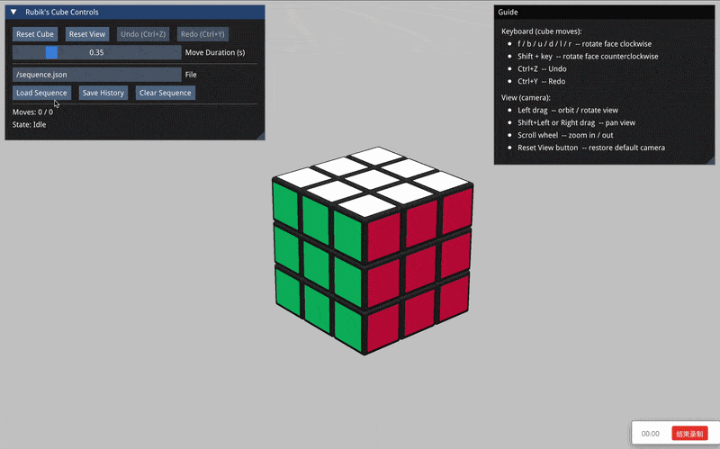

# 3x3-Rubik-s-Cube-Simulator



A 3×3 Rubik's Cube simulator implemented in Modern C++, supporting both Desktop and Web applications.

## Prerequisites

- **CMake** ≥ 3.20
- **C++17** compiler (GCC 9+, Clang 10+, MSVC 2019+)
- **SDL2** and **SDL2_mixer** (Desktop App only; optional for sound)
- **Emscripten SDK** (Web App only)

Other dependencies (Corrade, Magnum, Dear ImGui, spdlog, nlohmann/json) are fetched via CMake FetchContent.

**Install SDL2 (Desktop):**
- macOS: `brew install sdl2 sdl2_mixer`
- Ubuntu/Debian: `sudo apt install libsdl2-dev libsdl2-mixer-dev`
- Windows: [SDL](https://wiki.libsdl.org/Installation) or `vcpkg install sdl2 sdl2-mixer`

**Install Emscripten (Web):**
```bash
git clone https://github.com/emscripten-core/emsdk.git && cd emsdk
./emsdk install latest && ./emsdk activate latest
source ./emsdk_env.sh  # Run before each Web build session
```

---

## Build

| | Desktop App | Web App |
|---|---|---|
| **Directory** | `build/` | `build-web/` |
| **Configure** | `cmake ..` | `emcmake cmake -DBUILD_DESKTOP_APP=OFF -DBUILD_WEB_APP=ON ..` |
| **Build** | `cmake --build .` | `cmake --build .` |

### Desktop App

```bash
mkdir build && cd build
cmake ..
cmake --build .
```

### Web App

```bash
source ~/emsdk/emsdk_env.sh   # Activate Emscripten
mkdir build-web && cd build-web
emcmake cmake -DBUILD_DESKTOP_APP=OFF -DBUILD_WEB_APP=ON ..
cmake --build .
```

**CMake options:** `-DBUILD_DESKTOP_APP=ON/OFF`, `-DBUILD_WEB_APP=ON/OFF`, `-DBUILD_TESTS=ON/OFF`

---

## Run

| | Desktop App | Web App |
|---|---|---|
| **Command** | `./RubiksCube` or `./src/RubiksCube` | `cd build-web/bin && emrun --no_browser --port 8080 .` |
| **Open** | — | http://localhost:8080/RubiksCubeWeb.html |

Web output: `build-web/bin/` (HTML, JS, WASM, data). WASM must be served over HTTP; Python alternative: `python3 -m http.server 8080`.

---

## Features

- **Move sound:** Place `audio.mp3` in project root; desktop uses SDL2_mixer, web preloads it.
- **Camera:** Orbit, zoom, pan (right/middle drag or Shift+left drag).
- **Input:** Keyboard, mouse, file I/O — see [interface-specification.md](docs/interface-specification.md).
- **3D visualization** with move animation.

---

## Requirements

- [Magnum](https://github.com/mosra/magnum) — graphics engine
- [Corrade](https://github.com/mosra/corrade) — utilities
- SDL2 — desktop windowing/input
- Emscripten — WebAssembly toolchain
- Dear ImGui — UI
- [spdlog](https://github.com/gabime/spdlog) — logging
- CMake — build system

---

## Architecture

| Module | Components |
|--------|------------|
| **Utils** | Math, Timer, Logger, Config, File |
| **Core** | CubeState, Move, History |
| **Render** | Renderer, Camera, Light, Material, Mesh, Texture (Magnum scene graph) |
| **App** | DesktopApp (SDL2), WebApp (WASM), UI (ImGui) |
